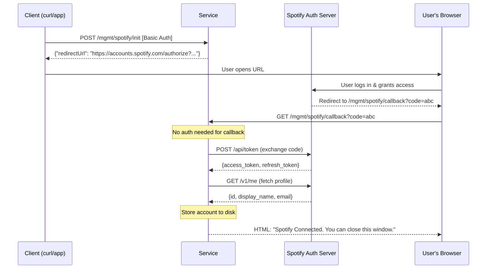
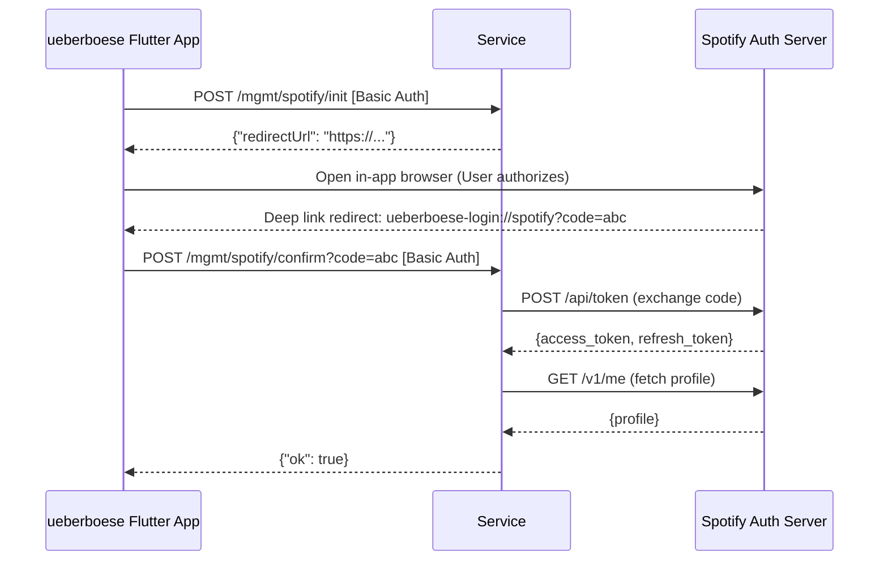
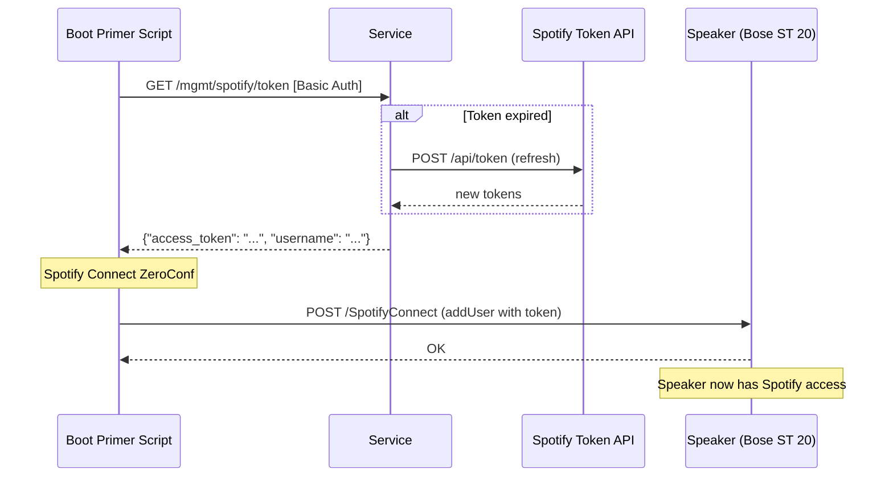

# Spotify OAuth Integration

The SoundTouch service supports Spotify OAuth integration to broker access tokens for SoundTouch speakers. This is particularly useful for maintaining Spotify Connect functionality after the Bose cloud shutdown (scheduled for May 2026).

## OAuth Flows

The service supports two primary OAuth flows: a browser-based flow and a mobile app-based flow (specifically for the [ueberboese](https://github.com/julius-d/ueberboese-app) app).

### 1. Browser-based Flow

The user initiates the flow, completes authorization in their browser, and is redirected back to the service.

### 2. Mobile App Flow (ueberboese)

The mobile app handles the redirect via a deep link and then confirms the authorization with the service.

### 3. Token Retrieval (Boot Primer / Speaker Setup)

Once an account is linked, access tokens can be retrieved for use with speakers (e.g., via the `addUser` ZeroConf command).

## Boot Primer Script

A boot primer script that uses these endpoints to feed Spotify tokens to speakers via ZeroConf is available in the `scripts/spotify/` directory: [spotify-boot-primer.sh](../../scripts/spotify/spotify-boot-primer.sh).

This script can be installed on the speaker itself (which runs embedded Linux) to automatically prime Spotify Connect at boot time. See [README.md](../../scripts/spotify/README.md) and [INSTALL.md](../../scripts/spotify/INSTALL.md) for instructions.

### Automated Installation via Service

The SoundTouch service provides a dedicated management endpoint to automatically handle the installation of the Spotify boot primer on the speaker:
`POST /mgmt/devices/{deviceId}/spotify/install-primer`

### Automated Installation Steps
When you run the Spotify primer installation, the service performs the following:
1.  **Directories**: Creates `/mnt/nv/bin` and `/mnt/nv/BoseApp-Persistence/1` on the speaker.
2.  **Binary**: Uploads the `spotify-boot-primer` script to the speaker.
3.  **Configuration**: Automatically generates and uploads `spotify-primer.conf` containing the service's URL and management credentials.
4.  **Boot Hook**: Injects a call to the primer in the speaker's `/mnt/nv/rc.local` using idempotent markers.
5.  **Environment**: Updates `/mnt/nv/.profile` to include `/mnt/nv/bin` in the `PATH` for easier manual troubleshooting via SSH.

- **Idempotent Patching**: The service uses explicit markers to inject the hook, ensuring it doesn't corrupt existing content.
- **Coexistence**: The service-injected hook is designed to coexist with a manually installed `rc.local` (e.g., from the community gist). It only adds a call to `/mnt/nv/bin/spotify-boot-primer` if it's not already managed by a service-controlled block.
- **Markers**: Look for the following markers in your speaker's `/mnt/nv/rc.local`:
  - `# --- Aftertouch Spotify hook START ---`
  - `# --- Aftertouch Spotify hook END ---`
- **Cleanup**: Reverting a migration via the service will cleanly remove these marker-delimited blocks.

## Endpoints

| Method | Path                                              | Auth  | Purpose                                                               |
|--------|---------------------------------------------------|-------|-----------------------------------------------------------------------|
| POST   | `/mgmt/devices/{deviceId}/spotify/install-primer` | Basic | Install Spotify boot primer on speaker (deviceId or IP)               |
| GET    | `/mgmt/spotify/callback`                          | None  | Browser OAuth callback (redirect from Spotify, returns HTML)          |
| POST   | `/mgmt/spotify/init`                              | Basic | Start OAuth flow, returns authorization URL                           |
| POST   | `/mgmt/spotify/confirm`                           | Basic | Mobile app confirm (ueberboese deep link delivers code, returns JSON) |
| GET    | `/mgmt/spotify/accounts`                          | Basic | List linked Spotify accounts (tokens stripped)                        |
| GET    | `/mgmt/spotify/token`                             | Basic | Get fresh access token (auto-refreshes if expired)                    |
| POST   | `/mgmt/spotify/entity`                            | Basic | Resolve Spotify URI to name + image URL                               |

## Security

- `/mgmt/spotify/callback` is intentionally outside Basic Auth to allow direct redirects from Spotify's authorization server.
- All other `/mgmt/*` endpoints require Basic Auth as configured by `--mgmt-username` and `--mgmt-password`.
- Tokens are persisted to disk as JSON with restricted file permissions (`0600`).
- The `GetAccounts` endpoint strips sensitive tokens from the response.
